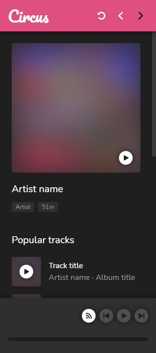
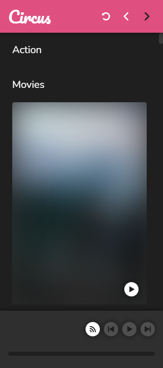
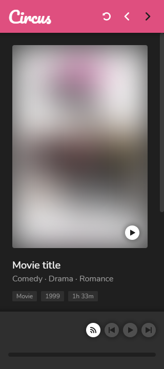
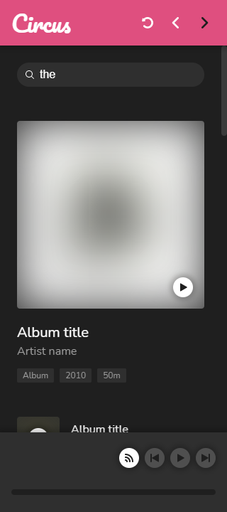
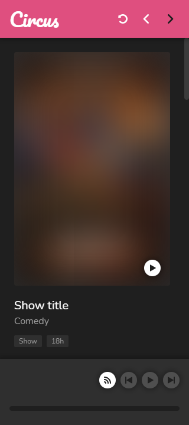
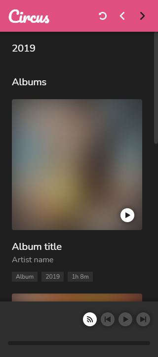

# @joelek/circus

Progressive web app and system for streaming audio and video content.


> The start page.

## Device support

* Devices with a modern web browser
* Devices implementing the Cast protocol
* Devices implementing the AirPlay (v1) protocol

## Media support

### Playback

Circus delivers streaming media through HTTP range requests and as such, media support will essentially be determined by the device of the user. The following containers and stream formats are recommended for optimal support.

```
Audio: MP4 (AAC)
Video: MP4 (H264 + AAC)
```

### Indexing

Circus features a blazingly fast, custom engine for probing and indexing of content. The engine supports the file formats listed below.

* JPEG
* JSON
* MP3
* MP4
* VTT

Stream information and metadata is extracted from all supported files. The information is stored and indexed into a custom database system.

External image and metadata files may be used to supply additional information that cannot be stored within a specific container. The external metadata files must use one of the structures listed below.

```json
{
	"type": "episode",
	"title": "Episode title",
	"season": 1,
	"episode": 1,
	"year": 2000, // Optional
	"summary": "Episode summary.", // Optional
	"show": {
		"title": "Show title",
		"summary": "Show summary.", // Optional
		"genres": [
			"Genre name"
		],
		"actors": [
			"Actor name"
		]
	}
}
```

```json
{
	"type": "movie",
	"title": "Movie title",
	"year": 2000, // Optional
	"summary": "Movie summary.", // Optional
	"genres": [
		"Genre name"
	],
	"actors": [
		"Actor name"
	]
}
```

```json
{
	"type": "track",
	"title": "Track title",
	"disc": 1,
	"track": 1,
	"album": {
		"title": "Album title",
		"year": 2000, // Optional
		"artists": [
			{
				"title": "Artist name"
			}
		]
	},
	"artists": [
		{
			"title": "Artist name"
		}
	]
}
```

The media probing system associates metadata on a folder basis meaning that external image and metadata files associate with every media file contained in the same directory.

## Playback protocol

Circus features a custom playback protocol for playback and synchronization between devices. The protocol is simplistically designed and built using websocket technology.

## Sponsorship

The continued development of this software depends on your sponsorship. Please consider sponsoring this project if you find that the software creates value for you and your organization.

The sponsor button can be used to view the different sponsoring options. Contributions of all sizes are welcome.

Thank you for your support!

## Installation

Circus can be installed on a wide range of server infrastructure since it's built almost entirely using NodeJS. Extra features such as preview images become available when the FFMPEG tool suite is installed on the server.

Download the latest release package from https://github.com/joelek/circus/releases and unpack it. Advanced users may clone the repository using git and gain a convenient way of upgrading whenever new releases become available.

The server is started using `node .` and should ideally be configured to run automatically as a background service. The command launches an HTTP server as well as an HTTPS server if a certificate file and a certificate key file can be located.

Visit the domain or IP-address of the server in any web browser and register your user using the registration key displayed when launching the server. The registration key is consumed upon successful registration.

Circus generates additional registration keys as soon as all registration keys have been consumed. You may use additional registration keys to register mutiple users.

Ports, paths and other settings can be configured through altering the config file located in the "./private/config/" directory. The config file is written to disk as Circus is launched.

## Screenshots



> The page of an artist.



> The page of a genre.



> The page of a movie.



> The search page.



> The page of a show.



> The page of a year.

## Roadmap

* Structure code using subprojects.
* Clear player state when the user logs out.
* Store create and update timestamps for entities.
* Add transactional capabilities to database.
* Create separate login and register forms.
* Grant admin privileges to the very first account created.
* Add account tiers to keys and users.
* Create full screen player with additional controls and graphics.
* Build supercut feature based on cue search results.
* Set document title based on page.
* Create and use layout components with standard spacing.
* Put languages in database.
* Add offline functionality with service workers.
* Improve stream detection algorithm.
* Index generated images.
* Move authentication to typesockets.
* Add synchronization to playback protocol.
* Add shuffle and repeat features to player.
* Index content at regular one hour intervals when inactive.
* Verify external track metadata functionality.
* Add filter to entity pages.
* Change line heights to prevent the truncation of capital letters with umlauts.
* Support downloading of images or copying of image urls.
* Stop sending tokens for every request.
* Index keyframes and create movie and episode subpage with list.
